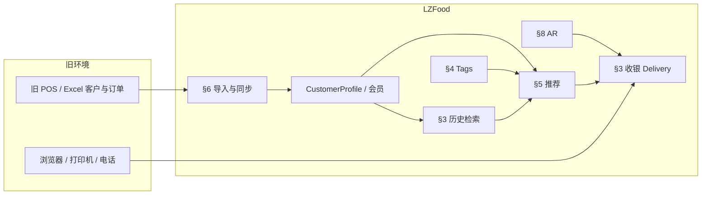

# 餐饮智能、客户延续与设备兼容 — 讨论结论（规格备忘）

> 本文档汇总 LZFood 在 **收银送餐、客户画像、菜品标签与推荐、AR 菜单、旧系统数据同步、现有设备续用** 方向的产品共识，供备查。  
> **申请 LEO 等补助请以 `docs/grant-application-brief.md` 为主**；本文可作为 Feasibility 研究范围的附录，不替代申请表。  
> 本文只描述产品边界，不规定技术实现方案。

**更新**：2026-05-21

**相关文档**：

- `docs/multi-store-spec.md` — 多店与 `storeId` 隔离  
- `docs/membership-module-spec.md` — 会员、储值、集点（与送餐客户档案并存规则见本文 §5）  
- `docs/membership-module-spec.md` 未覆盖的送餐 **CustomerProfile** 行为，以本文与当时收银送餐 UI 为准  

---

## 0. 产品定位（一句话）

LZFood 是面向爱尔兰及可扩展海外市场的 **B2B 多租户 Hospitality EPOS / 点餐 / 运营 SaaS**。  
差异化方向：**带着旧客户与旧设备上云**，再用 **地址与距离、订单历史、菜品标签、可解释推荐、AR 菜单** 提升送餐/电话单效率与复购——而不是要求商户推倒现有 POS 与硬件。

**资助 / 对外英文标题（可选用）**：

*Technical and Commercial Development of a Multi-Tenant B2B Hospitality EPOS Platform with Legacy Data Continuity, Device Interoperability, and Tag-Based Menu Intelligence.*

---

## 1. 范围与原则

### 1.1 在范围内

| 主题 | 说明 |
|------|------|
| 收银 **delivery** 工作流 | 距离、邮编、客户档案、历史与推荐展示 |
| **菜品 Tags** | 维护、检索、与订单历史聚合分析 |
| **推荐** | 辅助店员点单，可解释、可关闭 |
| **AR 菜单** | 与 Tags / 推荐联动展示，不替代 Tags 的数据角色 |
| **旧系统客户信息同步** | 导入、增量、与画像/推荐的关系 |
| **现有设备续用** | Web 平板、打印、电话、支付等分层兼容策略 |

### 1.2 原则

1. **辅助决策**：推荐结果供店员确认，**不自动写入购物车**（除非日后单独立项并重新拍板）。  
2. **按店隔离**：客户、历史、Tags、推荐规则均不跨店。  
3. **隐私与合规**：电话、地址、订单历史用于经营辅助；须可说明数据来源、保留期与删除（GDPR 方向，细则见 §9）。  
4. **渐进替换**：旧 POS / 旧系统可 **共存或单向迁移**；不承诺一次性替代所有品牌设备。  

### 1.3 不在本文范围

- 厨房 KDS 全套、聚合外卖平台深度对接、会计 ERP 全量对接（可另立 spec）。  
- 具体 grant 申请表格填写（仅提供 §10 叙事对齐）。  

---

## 2. 现状基线（Baseline，文档记录时点）

以下为对话时点上 **已存在或已具备方向** 的能力，V2 需求不得与下列事实矛盾；若代码已演进，以代码为准并回头更新本节。

### 2.1 收银 delivery（Cashier）

- 订单类型 **delivery**（含 phone 来源送餐等既有区分）。  
- **CustomerProfile**：按规范化电话等关联；同号多档案时 **优先选用带 Eircode / 邮编** 的档案。  
- **地址与 Eircode**：地址 geocode 补邮编；邮编校验与查询。  
- **配送距离** `deliveryDistanceKm` 与门店 **运费规则** 联动计费。  
- **常点菜品**：按客人电话（及关联档案）统计历史行项频次，收银侧展示 **Frequent items**（菜名级，非 Tag 级）。  
- **会员**：若启用会员模块，手机号可带出会员默认送餐地址等（与 Profile 并存规则见 §5）。  

### 2.2 菜单与 AR

- 菜品支持 **AR 资源**（如 USDZ，`arFileUrl`），顾客端可触发 AR 浏览（长按等交互以当时 UI 为准）。  

### 2.3 旧客户数据迁移（非产品化向导）

- 存在将外部 CSV 等导入 **CustomerProfile** 的 **一次性迁移路径**（运维/脚本级），尚未定义面向店主的 **自助导入向导** 与增量同步产品。  

### 2.4 设备

- **V1**：收银/顾客端以 **浏览器** 为主；小票以 **浏览器打印** 为主。  
- 未在产品层承诺 universal ESC/POS、CTI 弹屏等（见 §7 规划）。  

---

## 3. 收银 Delivery 增强（V2 需求）

在 §2.1 基线上，产品期望增加的 **送餐点单体验**（ID 供评审用）。

| ID | 需求 | 说明 |
|----|------|------|
| D1 | 距离与运费一致性 | 文档化：无有效 Eircode / 超配送半径 / geocode 失败时的 **提示与人工 override** 规则（是否允许店员改运费需拍板）。 |
| D2 | 地址完善 | 历史地址列表；选择档案一键填充姓名、地址、邮编；重复地址合并策略与 §6 同步规则一致。 |
| D3 | 订餐历史检索 | 除「常点 TOP N」外，支持按 **时间范围、订单状态、关键词** 查阅历史订单及行项（只读）。 |
| D4 | 再来一单 | 店员可选 **整单或部分行** 复用历史订单生成当前购物车；价格、售罄、菜单变更按 **当前菜单** 重算并提示差异。 |
| D5 | 来电上下文（预留） | 与 §7.2 电话集成衔接：来电识别后自动展开 §3 客户区（档案 + 历史 + 推荐）。 |

---

## 4. 菜品 Tags 体系（V2 需求）

### 4.1 目标

为每道菜打 **多标签**，用于：后台筛选、订单历史聚合、关联分析、推荐解释；并与 **AR**（体验层）分工明确。

### 4.2 Tag 模型（概念）

| 项 | 约定 |
|----|------|
| 多对多 | 一菜多 Tag；一 Tag 多菜。 |
| Tag 类型（示例） | 口味（辣）、饮食（素食、清真需另议）、场景（下酒、儿童）、烹饪（炸、蒸）、营销（招牌、新品）、与 **过敏原** 关系（见 §9） |
| 维护 | Admin 编辑；可选从分类/选项组 **继承默认 Tag**（是否继承需拍板）。 |
| 多语言 | Tag 展示名支持 i18n，与菜单语言策略一致。 |
| 与 AR | Tag **不负责 3D**；AR 负责「看」。推荐可优先展示 **带 AR 的招牌菜**（可配置权重，属产品策略非技术必达）。 |

### 4.3 需求列表

| ID | 需求 | 说明 |
|----|------|------|
| T1 | Tag CRUD | 店级 Tag 库；菜品勾选/批量打标。 |
| T2 | 历史兼容 | 无 Tag 的菜品仍可按 **menuItemId / 菜名** 做频次统计（降级路径）。 |
| T3 | 报表（可选） | Tag 销量汇总供店主选品（可 V2.1）。 |

---

## 5. 订单历史 × Tags × 推荐（V2 需求）

### 5.1 数据输入

- **身份键**：优先 `phoneNorm`；已登录/已关联时合并 **memberId** 与 **customerProfileId** 视角（同一手机合并画像 — **建议默认采纳**，见 §9）。  
- **历史来源**：LZFood 内订单；§6 导入的 legacy 订单（若启用）；不含其他店。  

### 5.2 分析层次（产品能力分阶段）

| 阶段 | 名称 | 输出（概念） |
|------|------|----------------|
| **A** | 规则层 | 历史菜品 Top N；同 Tag 热销；与当前购物车 Tag 补全（「您还常点…」） |
| **B** | 统计层 | Tag 频次画像；菜品共现；时段/星期偏好（如周五晚辣口） |
| **C** | 模型层（远期） | 协同过滤等；需单独立项、数据量与隐私评估 |

**文档默认**：对外承诺以 **A 为主、B 为 Feasibility/试点研究目标**；C 不写入近期承诺。

### 5.3 推荐展示（Cashier delivery）

| ID | 需求 | 说明 |
|----|------|------|
| R1 | 偏好 Tag 芯片 | 选电话后展示客人 **偏好 Tag** 排序（可解释：基于 N 笔历史订单）。 |
| R2 | 推荐菜卡片 | 菜名、价、Tag、可选 **AR 标识**；一键加购需店员确认。 |
| R3 | 关闭开关 | 店级配置「关闭智能推荐」，仅保留基础常点菜。 |
| R4 | 解释文案 | 每条推荐附带简短原因（如「过去 6 次点了辣味 Tag」），避免「黑盒 AI」表述。 |

### 5.4 顾客端（可选 V2.1）

- 菜单按 Tag 筛选；推荐区「招牌 / 适合您的口味」— 是否上线、是否与会员登录绑定，**待拍板**（§9）。  

---

## 6. 旧系统客户信息同步（Legacy Data Continuity）

### 6.1 目标

商户从 **旧 POS、Excel、其他外卖系统** 带来 **客户与（可选）历史订单**，避免重新录入；并为 §5 推荐提供数据基础。

### 6.2 与现状关系

- **Baseline**：脚本/CSV 导入 CustomerProfile 类路径已存在。  
- **V2**：产品化 **导入向导 + 增量同步 + 来源标记**。  

### 6.3 需求列表

| ID | 需求 | 说明 |
|----|------|------|
| L1 | 导入向导（Admin） | 上传 CSV/Excel；列映射（电话、姓名、地址、Eircode、备注）；预览、去重提示。 |
| L2 | 增量同步 | 定期再导入时 **merge**：以 `phoneNorm` + 地址键等更新；禁止盲目覆盖店员在 LZFood 内手工修正的字段（字段级策略需拍板）。 |
| L3 | 来源标记 | 记录 `legacy_import \| manual \| order_derived` 等，便于审计。 |
| L4 | 历史订单导入（可选） | 旧系统订单行 → 仅用于统计与推荐时，须约定金额/退款是否导入、是否进入 VAT 报表（**默认：不进报表，仅画像** — 建议采纳，可拍板）。 |
| L5 | 与 Tags | 导入订单映射到当前菜单 `menuItemId`；无法映射的行进入「未映射池」不参与 Tag 推荐直至人工关联。 |
| L6 | 与会员 | 导入档案可 **关联已有会员** 同号记录；不自动创建会员或充值。 |

### 6.4 双向同步

- **默认策略（建议写死）**：**单向进入 LZFood**；LZFood 为运营主系统；是否回写旧 POS **不做近期承诺**（若做，另 spec）。  

---

## 7. 现有设备续用（Device Continuity）

### 7.1 目标

降低换系统资本支出与培训成本；明确 **哪些继续用、哪些待验证、哪些不支持**。

### 7.2 分层（产品承诺级别）

| 层级 | 范围 | 产品表述 |
|------|------|----------|
| **A — 当前** | PC / 平板 / 手机浏览器；浏览器打印小票 | **无需新购收银硬件** 即可运行核心流程 |
| **B — 规划** | 热敏小票机 ESC/POS（网口/USB）；来电显示与 Web 收银联动（CTI） | **集成可行性** 为 Feasibility 课题；试点店验证型号清单 |
| **C — 共存** | 旧 POS 并行或只读对接 | 新单走 LZFood；旧系统渐退；对接方式 **个案评估** |
| **D — 不承诺** | 替换商户既有 Stripe Terminal / 软 POS 品牌；通用「所有打印机即插即用」 | 维护 **已测组合列表**，而非全品牌兼容 |

### 7.3 需求列表

| ID | 需求 | 说明 |
|----|------|------|
| H1 | 兼容原则文档 | 对店主说明 A/B/C/D，管理预期。 |
| H2 | 打印 | 保留浏览器打印；B 层 ESC/POS 为增值能力。 |
| H3 | 电话 | 与 D5、§3 衔接；不强制更换话机系统。 |
| H4 | AR | 顾客自有手机扫码，**不增加门店 AR 硬件**。 |

---

## 8. AR 菜单与 Tags / 推荐的协同

| 场景 | 行为（产品期望） |
|------|------------------|
| 顾客扫码 | 保留 AR 入口；可选 Tag 筛选（若 §5.4 启用） |
| 收银 delivery | 推荐列表标注 **可看 AR**；店员可话术引导 |
| 资助叙事 | **Immersive discovery（AR）+ data-driven upsell（Tags/推荐）** 组合，区别于纯二维码菜单 |

---

## 9. 待拍板问题（Discussion）

1. **过敏原**：Tag 与现有 `allergens` 字段是映射、重复还是分离？  
2. **顾客端推荐**：是否必须登录会员才展示个性化？匿名电话单仅收银侧画像？  
3. **历史订单导入**：是否进入营业报表，还是仅画像？（本文建议：默认仅画像）  
4. **画像合并**：非会员电话单与会员账号同号是否强制合并？（本文建议：是）  
5. **推荐关闭** 后是否仍展示常点菜频次？  
6. **数据保留期**：CustomerProfile 与导入历史保存多久、删除流程？  
7. **首批 legacy 格式**：优先支持通用 CSV 还是指定 1～2 种旧系统导出？  
8. **打印机/CTI 试点**：Feasibility 阶段验证的设备清单由谁提供（试点店）？  

---

## 10. 与资助叙事对齐（非申请表格）

| 资助类型 | 可对应的本文章节 |
|----------|------------------|
| **Feasibility** | §5 阶段 B；§6 迁移样本与映射；§7 B 层 CTI/打印 POC；§8 AR+Tag 商业可行性 |
| **Priming** | §6 导入向导与试点实施就业；§3 D4/D2 商业化；§7 A 层零硬件启动叙事 |
| **ITS / 出口** | B2B SaaS 多租户；§5 可出口软件服务；英国等同痛点扩展（另附市场一节时可引用 §0） |

**勿**将 §2 Baseline 已完成功能整体申报为 Feasibility 全新研发；新项目应锚定在 §3–§7 的 **V2 / 规划** 条目。

---

## 11. 逻辑关系（示意）

---

## 12. 如何引用本文档

- 路径：`docs/hospitality-intelligence-and-integration-spec.md`  
- 对话中：`@docs/hospitality-intelligence-and-integration-spec.md`  
- 开发任务拆解时应链接到具体 § 与 ID（如 `D3`、`T1`、`L2`），避免范围蔓延。  

---

## 13. 修订记录

| 日期 | 说明 |
|------|------|
| 2026-05-21 | 初稿：Delivery 智能、Tags、推荐、AR、legacy 同步、设备续用、资助对齐 |
